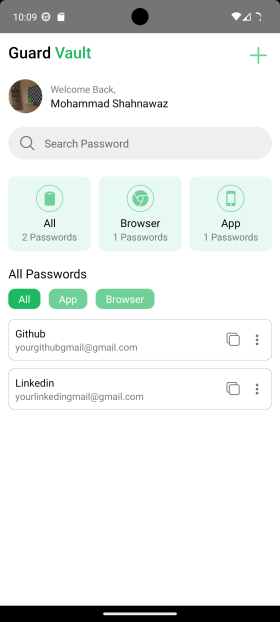
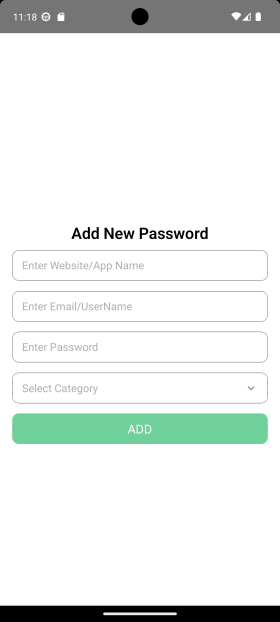
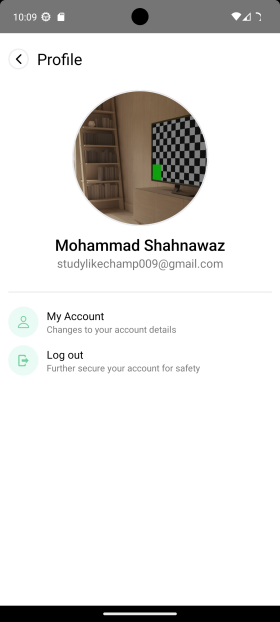
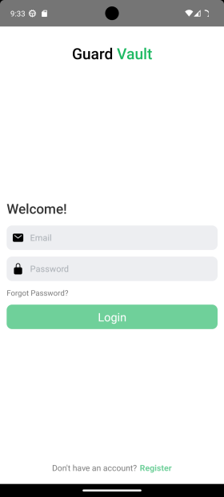
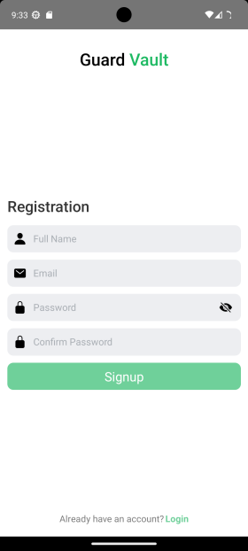

## GuardVault: A Secure Password Manager (Now Only For Android) in React Native

GuardVault is a user-friendly password manager application built with React Native, helping you manage your passwords securely on your Android device.

**Features:**

- **Secure Storage:** Passwords are stored using strong AES-256 encryption for maximum protection.
- **Add/Edit/Delete:** Easily Add/Edit/Delete vault.
- **Account Details Update:** Easily edit saved login information like username, profile image, mobile no, etc.
- **Forgot Password:** Recover your password through a secure process.

**Tech Stack:**

- **Front-End:**
  - React Native
  - React Navigation (navigation)
  - crypto-js (encryption)
- **Back-End (Optional):**
  - Node.js
  - Express.js
  - MongoDB (secure storage)

**Screenshots:**

**Security:**

GuardVault prioritizes security. Passwords are encrypted using the industry-standard AES-256 algorithm, ensuring they are unreadable even in the event of a data breach. Remember, creating strong and unique passwords remains crucial for robust password management.

**Contributing:**

We welcome contributions to this project! Please follow these guidelines:

1. **Fork the Repository:** Fork the GuardVault repository on GitHub.
2. **Clone Your Fork:** Clone the forked repository to your local machine.
3. **Development Environment:** Set up your development environment for React Native, including linking any necessary libraries and configuring a way to run the app. Refer to the official React Native documentation for detailed instructions: https://reactnative.dev/docs/getting-started.
4. **Make Changes:** Make your code contributions and enhancements.
5. **Commit and Push:** Commit your changes and push them to your forked repository on GitHub.
6. **Pull Request:** Create a pull request to submit your changes for review and potential inclusion in the main GuardVault project.

**Contact:**

Feel free to reach out with any questions or feedback at shahnawaz85748@gmail.com or checkout https://shahnawaz.vercel.app/
